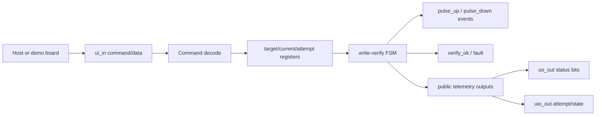

# Block diagram

Interpretation:

- The host loads symbolic state.
- The FSM does bounded control.
- The tile emits public events and status.
- A future memristive core would replace the symbolic current update with physical conductance update and sensing.
